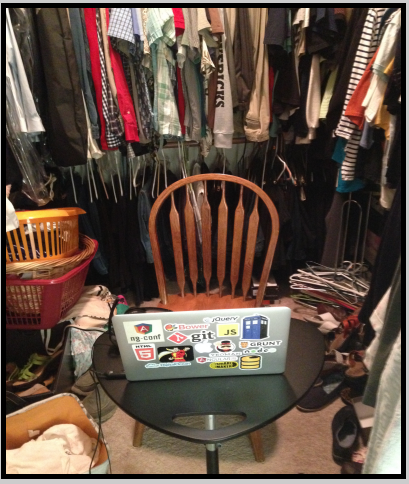

<h1 style="text-decoration: underline; color:black"> Audio Recording Tips 

<h2 style="text-decoration: underline; color:brown">  Good Quality Audio Narration 

<h4 style="color:black; font-family:Times New Roman">   The quality of your narration helps onscreen learning. Practice your narration before you record your screencast. 

<h2 style="color:black;">    Find a Quiet Spot in your House 

<h4 style="color:black;">    Avoid noise as much as possible. If noise overlaps your speech, post production audio cleaning tends to degrade audio quality.

<h2 style="text-decoration: underline; color:brown">   Choose the Right Mic 

<h4 style="color:black;">     Different mics have different recording characteristics. Reading the brochure should help understand its characteristics. 

<h2 style="text-decoration: underline; color:brown">   Place Blankets/Pillows Around your Recording Equipements 

<h4 style="color:black;">   This helps cancel out noise from equipements like PCs and laptops.

<h2 style="text-decoration: underline;">Clap Around the Room 

<h4 style="color:black;">     This helps detect rooms or areas with echo. Avoid rooms with echoes as it cannot be edited out of your narration. 

<h2 style="text-decoration: underline; color:brown">   A Room with Furniture Helps Cancel Echo 

<h4 style="color:black;">   Wood and other absorbing textures dampen echo and enhance audio quality. Record in a room that has furniture.

<h2 style="text-decoration: underline; color:brown">   Clothes are the Best Way to Avoid Echoes 

<h4 style="color:black;">   It's preferable to work in a room with clothes hung on all sides. 

<h2 style="text-decoration: underline; color:brown"> Avoid Editing Your Audio 

<h4 style="color:black;">   Do not use preset filters or noise removal techniques in your audio.

<h2 style="text-decoration: underline; color:brown">   Maintain a Steady Distance from the Mic 

<h4 style="color:black;"> Always maintain a fixed distance from the mic. Place it ideally 10cms from your mouth. 

<h2 style="text-decoration: underline; color:brown">Listen to Your Narration 

<h4 style="color:black;">   You can always improvise before you submit the content.
